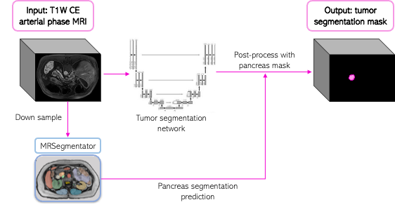
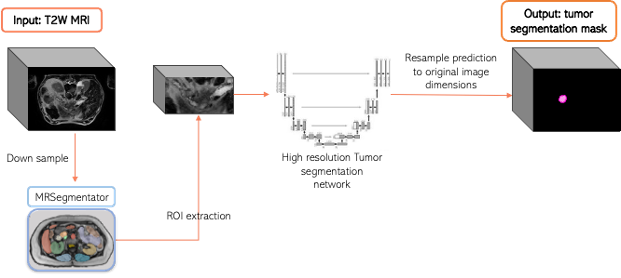

# Baseline Algorithms for the [PANTHER challenge](https://panther.grand-challenge.org/): Pancreatic Tumor Segmentation in Therapeutic and Diagnostic MRI
This repository contains the baseline algorithms for the PANTHER challenge. Model weights were uploaded to Zenodo and can be downloaded [here](https://zenodo.org/records/15211865).

## ▶️Task 1: Pancreatic Tumor Segmentation on Diagnostic MRIs

The algorithm is built on the [nnU-Net framework](https://github.com/MIC-DKFZ/nnUNet) (v2) [1] and employs a two-step process to segment pancreatic ductal adenocarcinoma (PDAC) on T1-weighted, contrast-enhanced arterial phase MRIs. In the first step, a nnU-Net model is trained for tumor segmentation. In the second step, the segmentation is refined through post-processing: the input image is downsampled to half its resolution, and a pancreas mask is generated using [MRSegmentator](https://github.com/hhaentze/MRSegmentator) [2]. The generated pancreas mask is then upsampled to the original resolution, and connected component analysis is applied to the tumor segmentation. 

Finally, only components that contain at least 10 voxels and have an overlap of at least 15% with the pancreas mask are retained, while the others are discarded. This process is summarized in Figure 1.



<p align="center">Figure 1: Pipeline of the baseline algorithm for Task 1 of the PANTHER challenge.</p>

### Tumor Segmentation Model training

The model was trained using pretrained weights from the baseline of the [PANORAMA challenge](https://panorama.grand-challenge.org/), available [here](https://zenodo.org/records/11160381). 

After formatting the dataset according to the nnU-Net (v2) framework requirements and properly setting all environment variables, training was initiated using the following commands:

```
nnUNetv2_plan_and_preprocess -d Dataset090_PantherTask1 --verify_dataset_integrity
cp /path/to/source/split_task1.json /path/to/nnUNet_preprocessed/Dataset090_PantherTask1/splits_final.json
nnUNetv2_train -d Dataset090_PantherTask1 0 3d_fullres -pretrained_weights /path/to/PANORAMA/weights/fold_0/checkpoint_best_panorama.pth
nnUNetv2_train -d Dataset090_PantherTask1 1 3d_fullres -pretrained_weights /path/to/PANORAMA/weights/fold_0/checkpoint_best_panorama.pth
nnUNetv2_train -d Dataset090_PantherTask1 2 3d_fullres -pretrained_weights /path/to/PANORAMA/weights/fold_0/checkpoint_best_panorama.pth
```
### Post-processing 
**PANCREAS SEGMENTATION ON LOW RESOLUTION**
Images are first downsampled to half its original resolution using the [resample_img](https://github.com/DIAGNijmegen/PANTHER_baseline/blob/main/TASK1_baseline/data_utils.py) function. Then, to generate pancreas segmentation masks, [MRSegmentator](https://github.com/hhaentze/MRSegmentator/) is used following the provided instructions:

Installation:

```
# Install MRSegmentator
python -m pip install mrsegmentator
```

Inference:
```
from mrsegmentator import inference
import os

outdir = "outputdir"
images = [f.path for f in os.scandir("image_dir")]
folds = [0]

inference.infer(images, outdir, folds)
```
**NOTE:** *To reduce computing time, inference with MRSegmentator was performed using only fold 0, rather than the full ensemble.
Also note the pancreas mask corresponds to label = 7.*

Finally the pancreas mask is upsampled to the original input dimensions using the [upsample_mask](https://github.com/DIAGNijmegen/PANTHER_baseline/blob/main/TASK1_baseline/data_utils.py) function and the connected components selection is done with the [filter_components](https://github.com/DIAGNijmegen/PANTHER_baseline/blob/main/TASK1_baseline/data_utils.py) function.

## ▶️ Task 2: Pancreatic Tumor Segmentation on MR-Linac MRIs
The algorithm is also based on the [nnU-Net framework](https://github.com/MIC-DKFZ/nnUNet) (v2) and consists of a two step approach for pancreatic tumor segmentation on T2-weighted MR-Linac MRIs, inspired by the baseline model[3] of the [PANORAMA challenge](https://panorama.grand-challenge.org/).
First a segmentation of the pancreas is obtained from downsampled images using [MRSegmentator](https://github.com/hhaentze/MRSegmentator/). Based on this segmentation a region of interest (ROI) around the pancreas is cropped from the original input T2W MRI. The cropped ROIS are then used to train a nnU-Net algorithhm. The process is shown in Figure 2.


<p align="center">Figure 2: Pipeline of the baseline algorithm for Task 2 of the PANTHER challenge.</p>

### Pancreas Segmentation on Low Resolution Images

As a preprocessing step, images are resampled to a spacing of **(3,3,6)**—three times the original mean spacing of the training set. Experimental results showed that reliable pancreas segmentation at lower resolutions was challenging, which motivated this approach. Resampling was performed using the [resample_img](https://github.com/DIAGNijmegen/PANTHER_baseline/blob/main/TASK2_baseline/data_utils.py) function, and the same process is applied to generate segmentation masks for all images as described in Task 1.

### Tumor Segmentation Model on Original Resolution

After generating the pancreas mask (label = 7), images in the training set are cropped using the custom [CropROI function](https://github.com/DIAGNijmegen/PANTHER_baseline/blob/main/TASK2_baseline/data_utils.py). A margin of 30 × 30 × 30 mm was used to ensure that the entire pancreas, along with some surrounding context, was included in the cropped volume. A tumor and pancreas segmentation model, pre-trained on the Task 1 training data, was then used as starting weights for training with the cropped T2-weighted dataset. The pre-training process follows the steps detailed [here](https://github.com/MIC-DKFZ/nnUNet/blob/master/documentation/pretraining_and_finetuning.md):

**Pre-training Commands:**

**Pre-training:**

```
nnUNetv2_plan_and_preprocess -d Dataset091_PantherTask2
nnUNetv2_extract_fingerprint -d Dataset093_PantherPretraining
nnUNetv2_move_plans_between_datasets -s Dataset091_PantherTask2 -t Dataset093_PantherPretraining -sp nnUNetPlans -tp nnUNetPlans91
nnUNetv2_preprocess -d Dataset093_PantherPretraining -plans_name nnUNetPlans91
nnUNetv2_train Dataset093_PantherPretraining 3d_fullres all -p nnUNetPlans91
```

**Training using the pre-trained weights:**

```
cp /path/to/source/split_task2.json /path/to/nnUNet_preprocessed/Dataset090_PantherTask1/splits_final.json
nnUNetv2_train -d Dataset091_PantherTask2 0 3d_fullres -pretrained_weights /path/to/pretrained/Task1/weights/fold_all/checkpoint_latest.pth
nnUNetv2_train -d Dataset091_PantherTask2 1 3d_fullres -pretrained_weights /path/to/pretrained/Task1/weights/fold_all/checkpoint_latest.pth
nnUNetv2_train -d Dataset091_PantherTask2 2 3d_fullres -pretrained_weights /path/to/pretrained/Task1/weights/fold_all/checkpoint_latest.pth
```
**NOTE:** Pretraining was done for 300 epochs to avoid overfitting.

### References

1. Isensee F, Jaeger PF, Kohl SAA, Petersen J, Maier-Hein KH. nnU-Net: a self-configuring method for deep learning-based biomedical image segmentation. Nat Methods. 2021 Feb;18(2):203-211. doi: 10.1038/s41592-020-01008-z. Epub 2020 Dec 7. PMID: 33288961.
2. Häntze, H., Xu, L., Dorfner, F. J., Donle, L., Truhn, D., Aerts, H., ... & Bressem, K. K. (2024). Mrsegmentator: Robust multi-modality segmentation of 40 classes in MRI and CT sequences. arXiv e-prints, arXiv-2405.
3. Alves, N., Schuurmans, M., Rutkowski, D., Yakar, D., Haldorsen, I., Liedenbaum, M., Molven, A., Vendittelli, P., Litjens, G., Hermans, J., & Huisman, H. (2024). The PANORAMA Study Protocol: Pancreatic Cancer Diagnosis - Radiologists Meet AI. Zenodo. https://doi.org/10.5281/zenodo.10599559
